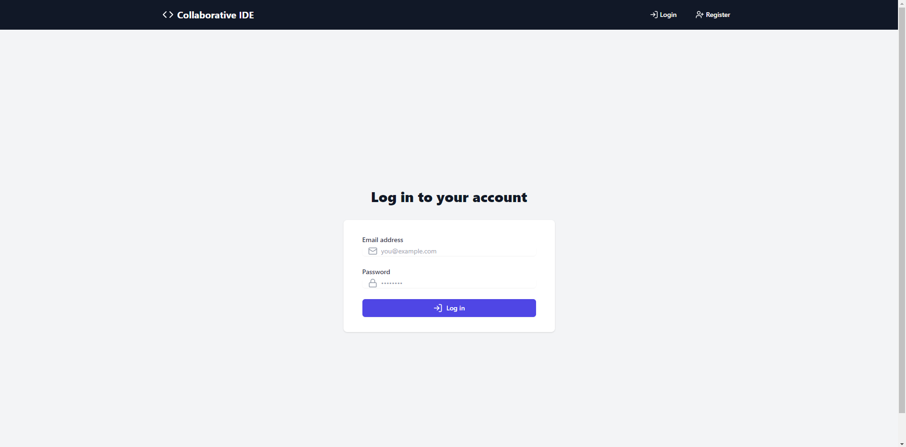
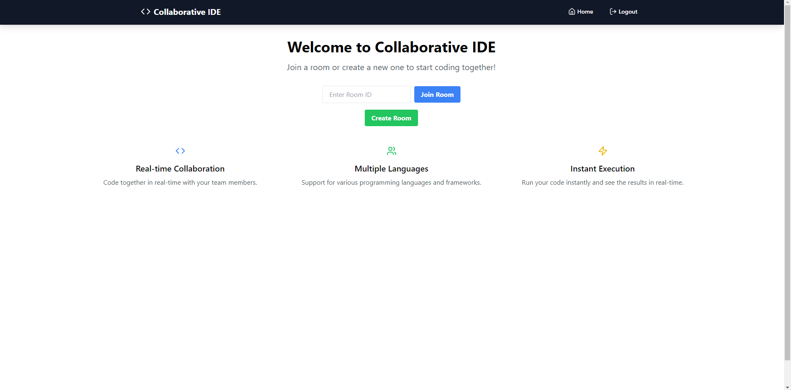
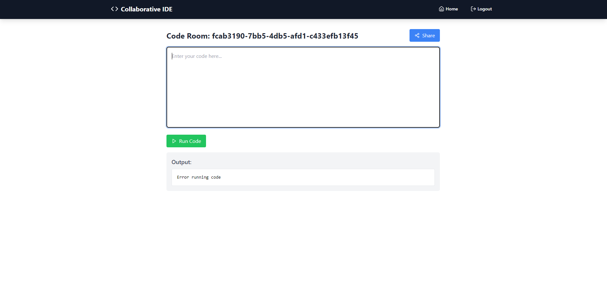

# Real-Time Collaborative IDE

A real-time collaborative Integrated Development Environment (IDE) built with the MERN (MongoDB, Express.js, React.js, Node.js) stack and WebSockets.



## Table of Contents

- [Features](#features)
- [Tech Stack](#tech-stack)
- [Getting Started](#getting-started)
  - [Prerequisites](#prerequisites)
  - [Installation](#installation)
- [Usage](#usage)
- [API Endpoints](#api-endpoints)
- [WebSocket Events](#websocket-events)
- [Contributing](#contributing)
- [License](#license)

## Features

- Real-time code collaboration
- User authentication and authorization
- Create and join coding rooms
- Syntax highlighting for multiple languages
- Code execution and output display
- Share room links with other users



## Tech Stack

- **Frontend**: React.js, Tailwind CSS
- **Backend**: Node.js, Express.js
- **Database**: MongoDB
- **Real-time Communication**: WebSocket (ws)
- **Authentication**: JSON Web Tokens (JWT)

## Getting Started

### Prerequisites

- Node.js (v14 or later)
- MongoDB
- npm or yarn

### Installation

1. Clone the repository:
   ```
   git clone https://github.com/ariel11212321/real-time-ide.git
   cd real-time-ide
   ```

2. Install dependencies for both frontend and backend:
   ```
   cd client && npm install
   cd ../server && npm install
   ```

3. Set up environment variables:
   - Create a `.env` file in the `server` directory
   - Add the following variables:
     ```
     MONGODB_URI=your_mongodb_connection_string
     JWT_SECRET=your_jwt_secret
     PORT=3001
     ```

4. Start the development servers:
   ```
   # In the server directory
   npm run dev

   # In the client directory
   npm start
   ```

## Usage

1. Register for an account or log in
2. Create a new coding room or join an existing one
3. Start coding! Your changes will be synced in real-time with other users in the room
4. Use the "Run" button to execute your code and see the output



## API Endpoints

- `POST /api/auth/register`: Register a new user
- `POST /api/auth/login`: Log in a user
- `GET /api/rooms`: Get all rooms
- `POST /api/rooms`: Create a new room
- `GET /api/rooms/:id`: Get a specific room
- `POST /api/run`: Execute code and return output

## WebSocket Events

- `join`: Join a specific room
- `code_update`: Send and receive code updates
- `chat_message`: Send and receive chat messages

## Contributing

Contributions are welcome! Please feel free to submit a Pull Request.

## License

This project is licensed under the MIT License - see the [LICENSE](LICENSE) file for details.
